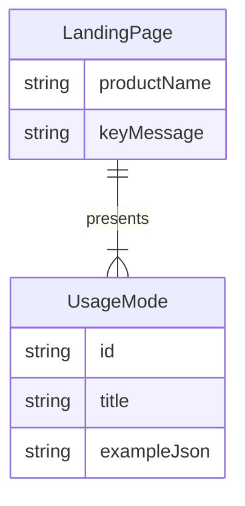

# 领域模型: ST MCU Selector

## 核心实体

## 业务规则（不可违反）

1. 必须把页面表述为短名单，不得写成设计签核
2. 竞品对照必须要求官方 datasheet 或用户提供的核实规格，不得从料号推断
3. 数据来源只能写 ST 公开 MCUFinder 数据包，不得声称复现 CubeMX Selector
4. Key Visual 锁定 Arial 与 ST 色板：`#03234B` `#FFD200` `#3CB4E6`
5. 终端用户通过网页或微信小程序完成推荐、竞品对照和订货号查询，不得把 ChatGPT MCP 当作唯一入口

## 术语表

| 中文术语 | 英文术语 | 定义 | 代码命名 |
|--------|--------|------|---------|
| 订货号 | ordering code | STM32 可下单型号 | `part_number` |
| 硬约束 | must | 不满足则剔除 | `must` |
| 偏好 | prefer | 只影响排序 | `prefer` |
| 短名单 | shortlist | 最多三个候选 | `recommendations` |

## 数据边界

### 数据源

| 数据源 | 类型 | 可信度 | 注意事项 |
|--------|------|--------|---------|
| cube-finder-db.zip | ST 公开数据包 | 权威产品数据 | 本页只说明，不下载 |

### 更新频率

| 数据源 | 更新周期 | 检查方式 |
|--------|---------|---------|
| 落地页文案 | 随 MCP 工具变更 | 人工对照 skill |

### 已知数据质量问题

- 公开库缺字段时，MCP 默认 allow_risk；页面必须写明这是风险保留

## 外部系统集成

| 系统 | 用途 | 认证方式 | 限制 |
|------|------|---------|------|
| ChatGPT MCP | 实际选型（内部） | 公网 HTTPS `/mcp` | 终端用户入口不依赖它 |
| Cloud Run | 托管网页 API | GCP 项目权限 | port 8080；缓存 `ST_MCU_GCS_BUCKET`；`*.run.app` 不能给微信用 |
| 阿里云 SAE | 托管 API 与静态页 | 阿里云账号 / RAM | port 8080；缓存 `ST_MCU_OSS_BUCKET`；需已备案自定义域名 |
| 微信小程序 | 工程师表单查询 | AppID + request 合法域名 | 生产必须 HTTPS + ICP；只指向阿里云域名 |
